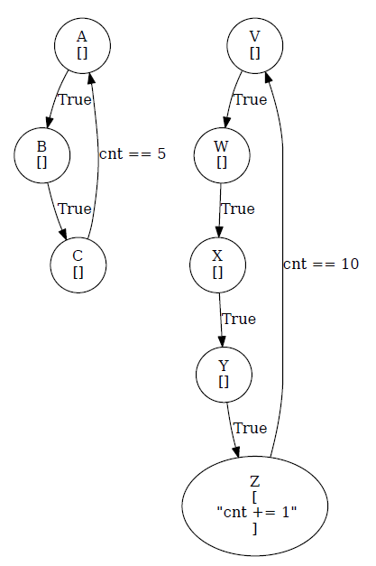

# Clock Error Modeler

This tool is intended to, in a basic sense, simulate the behavior of multiple concurrent finite state automata when a 
clock-variation error is introduced. It does so by allowing the user to interactively step through the behavior of FSAs input through a 
pre-defined JSON configuration file. Errors are introduced at specified points in time that simulation operation of an FSA 
in a positive (fast) or negative (slow) time difference.

*Created by Brian Rieder and Celeste Neary*

## Usage
There are two primary applications contained in this repository:
* Run `modeler.py` on any input JSON file that adheres to the standard defined below to simulate using that configuration: `python3 modeler.py input.json`
  * To output the adjusted FSA to JSON, simply type 'quit' and then hit Enter -- the reconfigured FSA will be output to `output_fsa.json`.
* Run `visualize_fsa.py` on any input JSON file that adheres to the standard defined below to draw the FSAs described by the configuration: `python3 visualize_fsa.py input.json`

## JSON Configuration File
The utility has three basic sections (all of which are further explained after the example):
* **config:** Section that specifies all of the characteristics of where the error is going to occur.
* **global_variables:** Section that contains all of the variables able to be referenced by the processes being simulated.
* **processes:** The nodes, edges, conditions, and actions associated with each process.

The following is a basic example of a JSON configuration file used by the utility:
```
{
  "config": {
    "process_to_delay": 0,
    "delay_amt": 10,
    "time_of_delay": 0,
    "is_slower": true
  },

  "global_variables": {
    "var": 0,
    ...
  },

  "processes": [
    {
      "name": "p1",
      "states": [
        {
          "name": "A",
          "actions": [
            "var += 1"
          ]
        },
        {
          "name": "B",
          "actions": []
        },
        ...
      ],
      
      "transitions": [
        {
          "from": "A",
          "to": "B",
          "condition": "var > 5"
        },
        {
          "from": "B",
          "to": "C",
          "condition": "True"
        },
        ...
      ]
    }, 
    ...
  ]
}
```

To provide a bit more detail regarding the above sections:
* config
  * "process_to_delay": The index (starting at 0) of the process that should be affected by the time delay/speed-up.
  * "delay_amt": The amount of delay/speed-up (in units of global time ticks) to be inserted.
  * "time_of_delay": The time at which to insert the delay/speed-up such that the process is no longer concurrent.
  * "is_slower": Whether or not the process being adjusted is running fast or slow compared to the other processes in the system.
* global_variables
  * These are defined at the user's discretion, but require an initial value.
* processes
  * "name": The label for this process.
  * "states": An array of all states containing their "name" and an array of arithmetic "actions".
  * "transitions": An array defining all relations between states, specifying "from" which a state is transitioned "to" under what "condition".


## visualize_fsa.py
When running this script with an input JSON file, the output looks as shown below. States are shown as nodes with their actions 
inside of themselves. Transitions and their conditions are shown as their corresponding edges.

